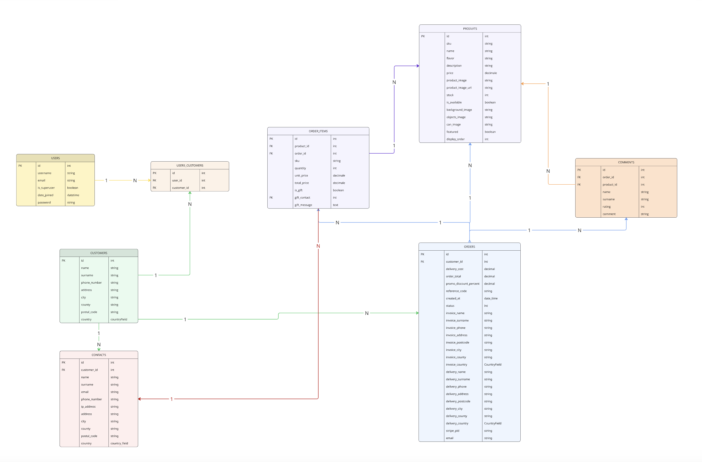

# Milky

<p align="center">
  
</p>

**Live Application:** *Not yet deployed — see [Deployment](#deployment) for the Heroku setup guide and what's still needed to get there.*

## About

**Milky** is a Django e-commerce website for a milkshake-in-a-can drinks brand. Visitors can browse the product range, read and leave reviews, add cans to a cart, check out with Stripe, and create an account to save delivery details and view past orders. A standout feature is **Gift a Can**: any logged-in customer can send a can straight to a friend's address as part of their order, at a 10% discount, without needing the friend's own account.

## Index – Table of Contents
* [User Experience (UX)](#user-experience-ux)
   * [Strategy](#strategy)
   * [Scope](#scope)
   * [Structure](#structure)
   * [Skeleton](#skeleton)
   * [Surface](#surface)

* [Technical Architecture](#technical-architecture)
   * [Admin Page](#admin-page)
   * [CRUD Operations](#crud-operations)
   * [User Feedback](#user-feedback)
   * [Database Schema](#database-schema)

* [Features](#features)
   * [Error Pages](#error-pages)

* [Future Features](#future-features)

* [Technologies Used](#technologies-used)

* [Testing](#testing)
   * [Authentication](#authentication)
   * [CRUD](#crud)
   * [Permissions](#permissions)
   * [Forms](#forms)
   * [UX](#ux)
   * [Responsive Design](#responsive-design)
   * [Bugs Found, Fixed, and Unresolved](#bugs-found-fixed-and-unresolved)
   * [Testing User Stories](#testing-user-stories)

* [Security & Current Limitations](#security--current-limitations)

* [Deployment](#deployment)
   * [Heroku Deployment Guide](#heroku-deployment-guide)

* [Credits](#credits)
   * [Visual Design References](#visual-design-references)
   * [Code References](#code-references)

## User Experience (UX)

### Strategy

With **Milky**, the goal was a warm, playful storefront for a single drinks brand that makes browsing flavors and checking out feel effortless, while giving the brand a low-friction way to turn customers into referrers through the Gift a Can feature.

#### Business goals of the website
- Present the product range attractively enough to drive purchases from a cold visit.
- Keep checkout friction low — guests can buy without an account, Stripe handles payment.
- Turn one-time buyers into repeat customers by saving delivery info and order history behind an account.
- Use Gift a Can as a built-in referral loop: a customer gets 10% off, a friend gets a free introduction to the brand.

#### Customer goals of the website
- Quickly understand what Milky is and see the available flavors.
- Get enough detail (description, nutrition facts, reviews) to decide before buying.
- Add products to a cart and check out quickly, with or without creating an account.
- Send a can as a gift to a friend in a couple of clicks.
- Manage delivery/invoice details and revisit past orders without re-entering everything.

#### User stories

**New Visitor**
- As a new visitor, I want to see the product range and understand the brand, so I can decide if it's for me.
- As a new visitor, I want to view a product's description, nutrition facts, and reviews, so I can make an informed choice.
- As a new visitor, I want to add products to my cart and check out as a guest, so I don't have to register just to buy something.
- As a new visitor, I want to create an account, so my delivery details are saved for next time.

**Existing User**
- As an existing user, I want to sign in and see my checkout form pre-filled with my saved details, so re-ordering is fast.
- As an existing user, I want to view my order history, so I can see what I've bought and when.
- As an existing user, I want to save a friend as a contact, so I can gift them a can without re-entering their details every time.
- As an existing user, I want to reset my password if I forget it.
- As an existing user, I want to leave a star rating and comment on a product, so I can share my opinion with other shoppers.

**All Users**
- As a user, I want clear confirmation before a destructive action (deleting a product, a saved contact) so I don't lose data by accident.
- As a user, I want feedback (toasts, inline form errors) after every action, so I always know whether it worked.
- As a user, I want the site to work well on my phone, tablet, and desktop.

#### Reasons for the website
- Direct-to-consumer sales channel for the Milky brand.
- Referral/gifting growth loop via Gift a Can.
- Building a returning customer base through saved profiles and order history.
- Collecting product reviews as social proof for new visitors.

### Scope

#### In scope Features:
- Product catalogue with a featured selection on the home page and a full grid on All Products.
- Product detail page: nutrition facts, benefit highlights, paginated reviews, and a review submission form for authenticated users.
- Session-based cart (add / update quantity / remove) with a live free-delivery progress banner, no account required.
- Gift a Can: pick a product and a recipient (saved contact or a new one), add an optional message, get 10% off the order.
- Stripe Payment Element checkout, with delivery + optional separate invoice address.
- Order confirmation page, reused as the order-detail view from the account's order history.
- Account system (django-allauth): register, sign in/out, mandatory email verification, password reset/change, email management.
- Profile page with three tabs: edit personal details, view order history, manage saved gift contacts (full CRUD).
- Superuser-only Products Management: add, edit, and delete products directly from the storefront UI.
- Toast notification system (success / error / warning / info) with a dynamic mini-cart preview on "added to cart" toasts.
- Custom branded 404 / 403 / 405 / 500 error pages.

#### Out of scope Features:
- Product search, filtering, or sorting.
- Wishlists or saved-for-later items.
- Subscriptions / recurring orders.
- Multiple gift recipients per order (currently limited to one gift per order).
- Editing or deleting an existing review once submitted.
- Self-service account deletion.
- Social login (Google/Facebook) — allauth is installed but no providers are configured.
- Real-time order tracking or shipping notifications.
- Loyalty points or a rewards program.
- Live chat support.

### Structure

The home page leads with a hero (an animated 3D can rendered with Three.js) and a "Shop Now" call to action, followed by a featured-products showcase and a nutrition/benefits section. From there, the flow is intentionally linear: browse products → view a product's detail page → add to cart → check out. A persistent navbar keeps Home, All Products, and Gift a Can within reach at all times, with the authenticated links (Profile, Products Management for superusers, Logout) appearing once signed in.

Milky is a multi-page application (MPA) with server-side rendering via Django — each route renders a dedicated template rather than switching views inside a single-page app. The cart and the in-progress gift selection both live in the session rather than the database, so nothing is written to the database until an order is actually placed.

Key sections and navigation flow:
- Home: hero with 3D can, featured products, nutrition/benefits section.
- All Products: full catalogue grid.
- Product Detail: description, nutrition facts, reviews, add to cart.
- Gift a Can: promo landing page for guests, full gift form for logged-in users.
- Cart: line items, gift line (if any), order summary.
- Checkout: delivery/invoice form + Stripe Payment Element.
- Order Confirmation: reused for both the post-checkout success page and the profile's order-history detail view.
- Auth: register, sign in, password reset, email verification (django-allauth).
- Profile: My Profile / Orders / Contacts tabs.
- Products Management (superuser only): add/edit/delete products.

#### Technical Implementation
- Django 6.0.4 with a multi-app architecture (`home`, `products`, `cart`, `checkout`, `accounts`).
- SQLite database in development — not yet configured for a production database (see [Deployment](#deployment)).
- Server-rendered templates with Bootstrap 5 utilities and `django-crispy-forms` (bootstrap5 pack).
- Session-based cart and in-progress gift state; nothing is persisted until checkout completes.
- Stripe Payment Element for payment, with a webhook handler as the reliability fallback that actually sends the confirmation and gift emails.
- `django-allauth` for authentication, with mandatory email verification.
- A single custom stylesheet (`static/css/base.css`) built around CSS custom properties, with fluid typography via `clamp()` and breakpoints at 768/1024/1440/1800px.
- Three.js renders and animates the rotating 3D can model on the home page hero.

## Technical Architecture

### Admin Page

The Django admin interface manages the core catalogue and order data:

**Products:**
- List view with name, flavor, SKU, price, stock, and thumbnail
- Filter by availability and flavor
- Full add/edit/delete access to every product field, including the three layered card images

<p align="center">
  
</p>

**Reviews:**
- List view with reviewer name, product, a ★/☆ star display, and a truncated comment
- Search by reviewer name or product, filter by rating or product
- Reviewer's username resolved and shown via the linked order, where one exists

<p align="center">
  
</p>

**Orders:**
- List view with reference code, customer, email, status, date, and totals
- Search by reference code or customer name, filter by status or date
- Grouped fieldsets (Order Info / Financials / Delivery Details / Invoice Details), with computed fields like `grand_total` shown read-only
- Inline, editable order items with a custom "same as delivery" admin widget that copies delivery details into the invoice fields
- Editing or deleting order items in the admin automatically recalculates the parent order's total

<p align="center">
  
</p>

**Customers, Contacts & Users:**
- Registered in the admin (create/view/edit/delete), using Django's default list views — no custom search or filtering configured for these three yet.

### CRUD Operations

**Milky** implements CRUD across its core features, split between the customer-facing UI and the Django admin:

#### **Products**
- **Create / Update / Delete**: superusers only, directly from the storefront (Products Management), or via the Django admin
- **Read**: everyone — home page (featured), All Products (full catalogue), and the product detail page

#### **Reviews**
- **Create**: authenticated users, from the product detail page
- **Read**: everyone, paginated 3 per page on the product detail page
- **Update / Delete**: not available to the review's author from the front end; superusers can edit or delete any review via the Django admin

#### **Cart (session-based, no database record)**
- **Create / Update / Delete**: add a product, change its quantity, or remove it — all reflected instantly (AJAX) without a page reload

#### **Gift a Can**
- **Create**: pick a product and a recipient, held in the session until the order is placed — limited to one gift per order
- **Read**: the gift line is shown in the cart and at checkout alongside the regular items
- **Delete**: removable from the cart before checkout to free up the "one gift" slot

#### **Orders**
- **Create**: created on successful Stripe payment (either via the browser return flow or, as a reliability fallback, via the Stripe webhook)
- **Read**: the order confirmation page, and the "Orders" tab of the account profile
- **Update**: order status only, via the Django admin (Pending / Completed / Cancelled) or automatically on a failed payment webhook

#### **Account (Customer profile & saved Contacts)**
- **Create**: a `Customer` record is created automatically the first time a signed-in user reaches checkout or their profile
- **Read / Update**: the "My Profile" tab of the account page
- **Contacts (saved gift recipients)**: full create, read, update, and delete from the "Contacts" tab

### **User Feedback**

**Toast Notifications** (four variants, driven by Django's messages framework):
- Success, error, warning, and info toasts, positioned as a fixed banner and capped at the site's max content width so they never sit past the page's right edge on wide screens
- Success toasts adapt their title and icon by context (cart, cart update, cart removal, product, review, gift, order, profile, contact)
- Adding an item to the cart shows a full mini-cart preview inline inside the toast: thumbnails, quantities, running total, and a free-delivery progress banner
- Error and warning toasts stay open until dismissed; success and info toasts auto-hide after 6 seconds

**Confirmation Modals** (triggered before destructive actions):
- **Delete Product Modal**: shown to superusers before permanently deleting a product, from any page that shows a product card
- **Delete Contact Modal**: shown before removing a saved gift recipient from the Contacts tab

**Empty States**:
- **Empty Cart**: "Your cart is empty" with a Shop Now call to action
- **No Reviews**: prompts a logged-out visitor to log in before they can leave one
- **No Orders**: "No orders found yet." on the profile's Orders tab
- **No Contacts**: "No friends yet." on the profile's Contacts tab

**Real-Time Feedback**:
- AJAX quantity updates and removals in the cart, with totals and the free-delivery banner updating in place
- AJAX-paginated reviews on the product detail page (no full page reload)
- Interactive star-rating picker on the review form (click/hover to set 1–5 stars)
- The Stripe Payment Element mounts lazily, only once the payment section scrolls into view

**Form Validation Errors**:
- Django/crispy-forms field errors are shown inline, directly below the relevant input
- Required fields are marked, and Stripe's own card-input validation surfaces inline card errors at checkout

### Database Schema

The app uses Django's ORM, with SQLite in development.

#### ERD — Entity Relationship Diagram

```
USER ||--o{ USERCUSTOMER : "linked via"
USERCUSTOMER }o--|| CUSTOMER : "resolves to"
CUSTOMER ||--o{ CONTACT : "has"
CUSTOMER ||--o{ ORDER : "places"
ORDER ||--o{ ORDERITEM : "contains"
PRODUCT ||--o{ ORDERITEM : "ordered as"
PRODUCT ||--o{ REVIEW : "receives"
ORDER ||--o{ REVIEW : "credits (optional)"
CONTACT ||--o{ ORDERITEM : "gifted to (optional)"
```

<p align="center">
  
</p>

**ERD note:** `User` ↔ `Customer` is resolved through an explicit `UserCustomer` join model rather than a `OneToOneField`. It isn't enforced as 1:1 at the database level, but the application always looks it up as if it were (`.filter(user=request.user).first()`).

**Legend:**
- **Solid line** — enforced One-to-One (via `OneToOneField`)
- **Dashed line** — ForeignKey relationship 1:N
- **PK** — Primary Key
- **FK** — Foreign Key

---

#### Core Models & Relationships

**1. User (Django's built-in auth model)**
- **Purpose:** authentication and session identity
- **Key fields:** `id`, `username`, `email`, `password` (hashed), `is_active`, `is_staff`, `date_joined`

---

**2. `accounts.UserCustomer`** — join table between `User` and `Customer`
- **Foreign Keys:** `user` (→ `User`, `CASCADE`), `customer` (→ `Customer`, `CASCADE`)
- **Fields:** `id`, `enabled` (BooleanField, default `True`)
- **Note:** logically 1:1 (app code always does `.filter(user=...).first()`), but not enforced with a DB-level uniqueness constraint.

---

**3. `accounts.Customer`**
- **Purpose:** the human profile behind an order — not tied 1:1 at the DB level, resolved via `UserCustomer`
- **Fields:**
  - `name`, `surname` (CharField(255), blank)
  - `display_name` (CharField(50), blank/null) — overrides the name shown on reviews, if set
  - `phone_number` (CharField(20), blank)
  - `address`, `city` (CharField(255), blank)
  - `county` (CharField(100), null/blank)
  - `postal_code` (CharField(20), blank)
  - `country` (CountryField via `django-countries`, null/blank)

---

**4. `accounts.Contact`** — a saved gift recipient ("friend")
- **Foreign Key:** `customer` (→ `Customer`, `CASCADE`)
- **Fields:** `name`, `surname` (CharField(255), required), `phone_number` (CharField(20), required), `email` (EmailField, required), `ip_address` (GenericIPAddressField, captured server-side at creation)

---

**5. `products.Product`**
- **Fields:**
  - `sku` (CharField(255), unique, auto-generated `MILK-XXXXXX`)
  - `name` (CharField(255), required)
  - `flavor` (CharField(50), choices: chocolate, vanilla, fruity, caramel, nutty, special)
  - `description` (TextField, soft cap 500 chars)
  - `price` (DecimalField, 6 digits / 2 decimal places)
  - `product_image` (ImageField) — legacy single image, used as a fallback
  - `background_image`, `objects_image`, `can_image` (ImageField) — the three layered images used to build each product card
  - `stock` (PositiveIntegerField, nullable)
  - `is_available` (BooleanField, default `True`)
  - `featured` (BooleanField, default `False`) — shown on the home page
  - `display_order` (PositiveIntegerField, default `0`)
- **Meta:** ordered by `display_order`, then `name`

---

**6. `products.Review`**
- **Foreign Keys:** `product` (→ `Product`, `CASCADE`, `related_name="reviews"`), `order` (→ `checkout.Order`, `SET_NULL`, optional — links a review to the order that "earned" it)
- **Fields:** `name`, `surname` (CharField(255), required), `rating` (PositiveIntegerField, 1–5, validated), `comment` (TextField(500), blank)

---

**7. `checkout.Order`**
- **Foreign Key:** `customer` (→ `accounts.Customer`, `SET_NULL`, nullable — guest orders have no linked customer)
- **Fields:**
  - `reference_code` (CharField(100), unique, auto-generated `ORDER-XXXXXXXX`)
  - `stripe_pid` (CharField(254), nullable)
  - `status` (IntegerField, choices: 0 Pending / 1 Completed / 2 Cancelled)
  - `created_at` (DateTimeField, auto)
  - `order_total` (DecimalField) — sum of its items, recalculated automatically whenever an item is saved
  - `delivery_cost` (DecimalField, default `0.00`) — recalculated on every save (free above £25, otherwise £3.99)
  - `promo_discount_percent` (DecimalField, nullable) — set when the order includes a gift
  - Separate `delivery_*` (required) and `invoice_*` (optional) address blocks, plus `email` (required)
- **Computed:** `grand_total` property = `order_total + delivery_cost`, minus the promo discount if set

---

**8. `checkout.OrderItem`**
- **Foreign Keys:** `order` (→ `Order`, `CASCADE`, `related_name="items"`), `product` (→ `Product`, `CASCADE`), `gift_contact` (→ `accounts.Contact`, `SET_NULL`, optional)
- **Fields:** `sku`, `unit_price` (snapshotted from the product at purchase time), `quantity`, `total_price` (auto-computed), `is_gift` (BooleanField, default `False`), `gift_message` (TextField, blank)
- **Side effect:** saving an `OrderItem` also recalculates and re-saves its parent `Order`'s `order_total`

---

#### Relationships Summary

| Relationship | Models involved | Type | Enforcement |
|---|---|---|---|
| User ↔ Customer | User, UserCustomer, Customer | Effectively One-to-One | Join model, app-enforced only |
| Customer → Contact | Customer, Contact | One-to-Many | `ForeignKey` + `CASCADE` |
| Customer → Order | Customer, Order | One-to-Many | `ForeignKey` + `SET_NULL` |
| Order → OrderItem | Order, OrderItem | One-to-Many | `ForeignKey` + `CASCADE` |
| Product → OrderItem | Product, OrderItem | One-to-Many | `ForeignKey` + `CASCADE` |
| Product → Review | Product, Review | One-to-Many | `ForeignKey` + `CASCADE` |
| Order → Review | Order, Review | One-to-Many, optional | `ForeignKey` + `SET_NULL` |
| Contact → OrderItem | Contact, OrderItem | One-to-Many, optional | `ForeignKey` + `SET_NULL` |

---

#### Data Flow Examples

**Example 1 — First checkout**
1. A signed-in user with no `Customer` yet reaches checkout.
2. A blank `Customer` and its `UserCustomer` link are created automatically.
3. The delivery form is saved back onto that `Customer` if "save this delivery info" is checked.

**Example 2 — Gift a Can**
1. The user picks a product and a recipient (existing `Contact`, or creates a new one) on the Gift a Can page.
2. The selection is held in `request.session['gift']` — nothing is written to the database yet.
3. On successful payment, an `OrderItem` is created with `is_gift=True` and `gift_contact` set, and a gift confirmation email is sent to the recipient.

**Example 3 — Order creation has two paths**
1. The browser is redirected back from Stripe to `checkout_success`, which creates the `Order` + `OrderItem`s directly — this is the happy path.
2. Independently, Stripe's `payment_intent.succeeded` webhook creates the same order from the PaymentIntent's metadata **if it doesn't already exist** (looked up by `stripe_pid`) — this is the reliability fallback, and it's also the only path that actually sends the confirmation and gift emails.

### Skeleton

No dedicated wireframe files were produced for this project — the responsive layout was designed and refined directly in the browser across the 768/1024/1440/1800px breakpoints.

### Surface

#### Visual Style

**Design:**
A warm, playful storefront built around soft rounded cards, layered product imagery, and a cream-and-brown color language. Product cards are composed from three stacked images (background, floating objects, can) for a bit of depth, and a rotating 3D can model anchors the home page hero.

**Typography:**
`Bebas Neue` is used for headings, `Poppins` for body text — both loaded from Google Fonts. Type sizes are fluid (`clamp()`-based) rather than jumping at fixed breakpoints, so headings and body text scale smoothly with the viewport.

#### Colors
The palette centers on warm cream backgrounds with brown text, gold for primary calls to action, and green for success/discount highlights.

| Token | Hex | Use |
|---|---|---|
| `--light-cream` | `#faeade` | Page background |
| `--brown` | `#523122` | Primary text |
| `--light-brown` | `#8c5e4a` | Secondary text |
| `--gold` | `#fbcb62` | Primary CTA buttons |
| `--green` | `#198754` | Success states, discounts |
| `--danger` | `#dc3545` | Errors |
| `--card-background` | `#fafafa` | Card surfaces |
| `--footer-background` | `#e9cfb7` | Footer |

<p align="center">
  
</p>

## Features

#### **Navigation**
- **Public Navigation**: Home, All Products, Gift a Can, Sign In, Register
- **Authenticated Navigation**: Home, All Products, Gift a Can, My Profile, Sign Out, plus **Products Management** for superusers only

<p align="center">
  
</p>

- Mobile navigation collapses into a menu with an auto-close-on-outside-click behavior

#### **Home Page**
- **Hero Section**: an animated, rotating 3D can (rendered with Three.js) over a brand watermark, with a "Shop Now" call to action
- **Our Favorites**: a grid of the products flagged `featured`, each card built from three layered images and animated with a subtle mouse-tilt parallax effect; superusers see an Edit/Delete overlay on every card
- **It's Still Good For You**: a benefits section with a stats card (Calcium / Protein / Vitamin D)
- **Moments That Taste Better**: a lifestyle photo section

<p align="center">
  
</p>

#### **All Products**
- Full product grid using the same card component and superuser overlay as the home page
- Each card links through to its product detail page

<p align="center">
  
</p>

#### **Product Detail**
- Layered product image, with an "Coming Soon" state if a product isn't yet available, and an "Out of Stock" state at zero stock
- Quantity selector and Add to Cart
- Benefit highlight icons and a nutrition-facts table (per 100ml / per 330ml)
- Paginated reviews (3 per page, loaded via AJAX without a full reload) with a star-rating display
- A star-picker review form for authenticated users, or a "Sign In to leave a review" prompt for guests

<p align="center">
  
</p>

#### **Gift a Can**
- **Logged out**: a promo landing page — hero image, a 3-step "how it works" explainer, and Sign In/Register calls to action
- **Logged in**: a full gift form — a custom product picker, an optional personal message, and either a saved contact or new-friend fields
- If a gift is already in the session, the page shows a locked state instead (one gift per order)

<p align="center">
  
</p>

#### **Cart**
- Line items with an AJAX quantity stepper (clamped 1–99) and AJAX remove
- A separate, non-editable gift line if a Gift a Can is in progress, with its own remove button
- An order summary card (subtotal, delivery, gift discount, grand total) and a live free-delivery progress banner
- **Empty state**: cart icon, "Your cart is empty" message, Shop Now button

<p align="center">
  
</p>

#### **Checkout**
- Details / Delivery / Invoice / Payment sections, laid out in a two-column responsive layout from tablet width up, with a sticky order summary
- "Same as delivery" checkbox that hides/shows the invoice fields
- "Save this delivery info to my profile" checkbox for authenticated users, or a login/register prompt for guests
- Stripe Payment Element, mounted only once it scrolls into view
- Disabled "Complete Order" button until Stripe reports the payment form is ready

<p align="center">
  
</p>

#### **Order Confirmation**
- Reference code, itemized line items, price recap, delivery address, and a "Continue Shopping" call to action
- The same template doubles as the order-detail view reached from the profile's Orders tab

<p align="center">
  
</p>

#### **Profile**
- **My Profile**: edit name, surname, phone, address, city, postal code, and country
- **Orders**: a list of past orders with a status badge (Pending / Completed / Cancelled), linking to the order detail view, or a "No orders found yet." empty state
- **Contacts**: saved gift recipients, with inline edit-in-place, a delete-confirmation modal, an "Add a Friend" form, or a "No friends yet." empty state
- The active tab is remembered across redirects (for example, after adding a contact you land back on the Contacts tab)

<p align="center">
  
</p>

#### **Products Management (Superuser Only)**
- Add / Edit forms grouped into Info, Cart & Checkout Image, Product Card Visuals (the three layered images), and Stock & Visibility sections
- Custom file-upload widgets showing the current image with a "Remove Image" option
- Delete has no dedicated page — it's triggered from a shared confirmation modal, available on any product card

<p align="center">
  
</p>

#### **Authentication Pages** (django-allauth)
- Register, Sign In, Sign Out, Password Reset (request/sent/confirm/done), Password Change, Password Set, and email address management
- Mandatory email verification before a new account can sign in
- Each branded auth page follows the same split layout: a form on one side, an illustration on the other (hidden below tablet width)

<p align="center">
  
</p>

#### **Toast Notification System**
- Success, error, warning, and info variants, with context-specific titles and icons
- Adding a product to the cart shows a live mini-cart preview inside the toast itself

<p align="center">
  
</p>

#### **Footer**
- Social media links (X, Instagram, Facebook), each with an accessible label
- Copyright notice
- Consistent across every page

<p align="center">
  
</p>

### Error Pages
All four custom error pages share the same branded layout: a breakpoint-swapped illustration, the status code, a short title, a plain-language message, and a single "Back to Home" call to action.

| Error Code | Title Shown | Message Shown |
|---|---|---|
| **404** | Page Not Found | "The page you're looking for doesn't exist or has been moved." |
| **403** | Access Forbidden | "You don't have permission to access this page." |
| **405** | Method Not Allowed | "This request method is not supported for this page." |
| **500** | Server Error | "Something went wrong on our end. Please try again in a moment." |

<p align="center">
  
  
  
  
</p>

#### **Responsiveness**
- Mobile-first, with custom breakpoints at 768px, 1024px, 1440px, and 1800px, plus a small tweak below 360px
- Fluid typography via `clamp()` instead of hard jumps between breakpoints
- The checkout page reflows into a two-column layout with a sticky order summary from tablet width up
- The whole site is capped at a 1800px max content width and centered, so fixed elements (like the toast banner) are aligned to the content edge, not the raw screen edge, on ultra-wide screens

## Future Features

- **Product search, filtering, and sorting** on the All Products page
- **Wishlists** — save a product for later without adding it to the cart
- **Subscriptions** — recurring delivery of a favorite flavor
- **Multiple gift recipients per order**, instead of the current one-gift limit
- **Editable/deletable reviews** from the front end, for the reviewer
- **Self-service account deletion**
- **Social login** (Google/Facebook) — `django-allauth` already supports it, no providers are configured yet
- **Order tracking / shipping notifications**
- **A loyalty or rewards program**
- **Live chat support**
- **Multiple photos per review**

## Technologies Used

__Languages Used__

* [HTML5](https://en.wikipedia.org/wiki/HTML5)
* [CSS](https://en.wikipedia.org/wiki/CSS)
* [JavaScript](https://en.wikipedia.org/wiki/JavaScript)
* [Python](https://en.wikipedia.org/wiki/Python_(programming_language))

__Frameworks, Libraries & Tools Used__

* [Django](https://www.djangoproject.com/): the web framework the whole project is built on
* [django-allauth](https://docs.allauth.org/): authentication, registration, and email verification
* [django-crispy-forms](https://django-crispy-forms.readthedocs.io/) + [crispy-bootstrap5](https://pypi.org/project/crispy-bootstrap5/): form rendering with the Bootstrap 5 template pack
* [django-countries](https://pypi.org/project/django-countries/): country selection fields on delivery/invoice forms
* [Stripe](https://stripe.com/docs) (Payment Element + webhooks): checkout and payment confirmation
* [Bootstrap 5](https://getbootstrap.com/docs/5.3/getting-started/introduction/): responsive layout, utility classes, and the base for the crispy-forms template pack
* [Font Awesome](https://fontawesome.com/): icons throughout the UI
* [Google Fonts](https://fonts.google.com/): `Bebas Neue` and `Poppins`, the site's two typefaces
* [Three.js](https://threejs.org/): renders and animates the 3D can model on the home page hero
* [Pillow](https://pypi.org/project/pillow/): image handling for uploaded product photos
* [GitHub](https://github.com/): source control and repository hosting
* [Django Admin](https://docs.djangoproject.com/en/stable/ref/contrib/admin/): back-office management for products, reviews, and orders

## Testing

Testing on this project has been manual so far, centered on the flows exercised while building and fixing features: authentication, CRUD, permissions, forms, UX, and responsive layout. **There is currently no automated test suite** — every app's `tests.py` is still the default Django stub, and no CI pipeline is configured.

### Authentication

| Test Label | Test Action | Expected Outcome | Test Outcome |
|------------|-------------|------------------|--------------|
| Registration | Register with a new email and password | Account created, verification email sent (console backend in dev) | PASS |
| Mandatory Email Verification | Try to sign in before verifying the email | Sign-in is blocked until the email is verified | PASS |
| Sign In | Sign in with valid credentials | User is authenticated and redirected | PASS |
| Invalid Sign In | Sign in with the wrong password | Error message shown, user stays on the sign-in page | PASS |
| Password Reset | Request a reset link for a registered email | Reset flow completes and the new password works | PASS |
| Sign Out | Click Logout in the navbar | User is signed out and redirected | PASS |

### CRUD

| Test Label | Test Action | Expected Outcome | Test Outcome |
|------------|-------------|------------------|--------------|
| Add Product (superuser) | Fill in the product form and submit | Product created and immediately visible in the catalogue | PASS |
| Edit Product (superuser) | Change a product's fields and save | Changes reflected everywhere the product appears | PASS |
| Delete Product (superuser) | Confirm deletion from the shared modal | Product removed from the catalogue | PASS |
| Add Review | Submit a star rating and comment on a product | Review appears in the paginated list | PASS |
| Add / Edit / Delete Contact | Manage a saved gift recipient from the Contacts tab | Contact list updates immediately, in place | PASS |
| Place Order | Complete checkout with a Stripe test card | Order created, confirmation page shown, order appears in Orders tab | PASS |

### Permissions

| Test Label | Test Action | Expected Outcome | Test Outcome |
|------------|-------------|------------------|--------------|
| Products Management Access | Visit `/products/add/` while logged out or as a non-superuser | Redirected home with an error message | PASS |
| Profile Access | Visit `/profile/` while logged out | Redirected to sign in | PASS |
| Own-Data Scoping | Try to view another user's order confirmation page directly | Access denied unless it's the current session's own order | PASS |
| Guest Order Confirmation | View the confirmation page right after a guest checkout | Accessible, since the reference code matches the session | PASS |

### Forms

| Test Label | Test Action | Expected Outcome | Test Outcome |
|------------|-------------|------------------|--------------|
| Checkout Validation | Submit the checkout form with required fields missing | Inline validation errors shown, submission blocked | PASS |
| Same as Delivery | Toggle the "same as delivery" checkbox at checkout | Invoice fields hide/show accordingly | PASS |
| Gift Form Validation | Submit the Gift a Can form without selecting a product | Submission blocked client-side | PASS |
| Review Rating Required | Submit the review form without picking a star rating | Submission blocked | PASS |

### UX

| Test Label | Test Action | Expected Outcome | Test Outcome |
|------------|-------------|------------------|--------------|
| Cart Quantity Update | Use the +/- stepper on a cart line | Quantity and totals update in place via AJAX, no reload | PASS |
| Toast Feedback | Add a product to the cart | Success toast appears with a live mini-cart preview | PASS |
| Delete Confirmation | Click delete on a product (superuser) or a contact | Confirmation modal appears before anything is removed | PASS |
| Review Pagination | Page through a product's reviews | Review list swaps via AJAX without a full reload | PASS |

### Responsive Design

| Device Category | Screen Size | Test Result | Notes |
|----------------|-------------|-------------|-------|
| Mobile - Small | 390px × 844px | PASS | |
| Tablet | 768px × 1024px | PASS | Checkout switches to its two-column layout here |
| Tablet/Small Desktop | 1024px × 900px | PASS | |
| Laptop | 1440px × 1000px | PASS | |
| Desktop - Large | 2560px × 1300px | PASS | Verified the toast banner and body content stay aligned at the 1800px max content width |

### Bugs Found, Fixed, and Unresolved

| Bug | Status | Notes |
|-----|--------|-------|
| Toast notifications pinned to the raw screen edge on screens wider than 1800px | Fixed | The toast wrapper used Bootstrap's `w-100` on a `position: fixed` element, which resolves against the viewport rather than the centered, max-width body. It's now capped at the same max content width and centered. |
| Horizontal overflow on the home page on mobile | Fixed | Two Bootstrap `.row`s sat directly inside a `<section>` with no `.container` parent, so the default negative row gutters bled past the viewport edge. Wrapping both rows in `.container` fixed it. |
| Account pages skipped from `<body>` straight to `<h2>`, with no `<h1>` anywhere on the page | Fixed | Promoted each account page's main heading to `<h1>`, with a sizing utility class so the visual size didn't change. |
| `checkout/views.py` calls `reverse("products")` and `reverse("cart")`, but those URL names don't exist (they're `all_products` and `view_cart`) | Unresolved | Would raise `NoReverseMatch` if those specific redirect paths are hit (checking out with an empty cart, or a missing product during order confirmation). |
| Hardcoded `DEBUG=True` and SQLite-only configuration | Unresolved | Not a bug in behavior, but a real gap before this project could go to production — see [Security & Current Limitations](#security--current-limitations). |

### Testing User Stories

| User Story | How It's Fulfilled | Features/Pages Used |
|------------|-------------------|---------------------|
| As a new visitor, I want to see the product range and understand the brand. | The home page opens with a hero and a featured-products showcase; All Products shows the full catalogue. | Home page, All Products |
| As a new visitor, I want to view a product's description, nutrition facts, and reviews. | The product detail page shows all three, plus a paginated review list. | Product Detail |
| As a new visitor, I want to add products to my cart and check out as a guest. | The cart and checkout flows don't require an account; `Order.customer` is nullable for guest orders. | Cart, Checkout |
| As a new visitor, I want to create an account so my details are saved for next time. | Registration via django-allauth, with delivery details saved to the `Customer` profile on request. | Register, Checkout ("save this delivery info") |
| As an existing user, I want my checkout form pre-filled. | The checkout view builds the form from the signed-in user's saved `Customer` record. | Checkout |
| As an existing user, I want to view my order history. | The profile's Orders tab lists past orders, linking to the reused confirmation template. | Profile — Orders tab |
| As an existing user, I want to save a friend as a contact for gifting. | The profile's Contacts tab supports full CRUD on saved gift recipients. | Profile — Contacts tab, Gift a Can |
| As an existing user, I want to reset my password. | django-allauth's password reset flow. | Password Reset |
| As an existing user, I want to leave a star rating and comment on a product. | The review form on the product detail page, restricted to authenticated users. | Product Detail |
| As a user, I want clear confirmation before a destructive action. | Shared confirmation modals for product deletion and contact deletion. | Products Management, Profile — Contacts tab |
| As a user, I want feedback after every action. | The toast notification system, plus inline form validation errors. | Site-wide |
| As a user, I want the site to work well across devices. | Fluid typography and four custom breakpoints (768/1024/1440/1800px), verified manually across mobile, tablet, laptop, and wide desktop. | Site-wide |

## Security & Current Limitations

- **Environment variables:** `SECRET_KEY`, `STRIPE_PUBLIC_KEY`, `STRIPE_SECRET_KEY`, and `STRIPE_WH_SECRET` are all read from environment variables (via a local, gitignored `env.py` in development), not hard-coded.
- **CSRF protection:** Django's CSRF middleware is active; server-rendered forms include ``, and the Stripe webhook endpoint is the only intentionally `@csrf_exempt` view (verified instead via the Stripe signature header).
- **Authentication & access control:** views that mutate data are gated with `@login_required`; the Products Management views additionally check `request.user.is_superuser` before allowing add/edit/delete. Order confirmation pages are scoped so a guest can only view the order matching their own session, and an authenticated user can only view their own orders.
- **Mandatory email verification:** `django-allauth` is configured with `ACCOUNT_EMAIL_VERIFICATION = "mandatory"`, so an account can't sign in until its email is confirmed.

**Not yet production-configured** — this project currently runs as a local development app, and the following would need addressing before a real deployment:
- `DEBUG = True` is hardcoded in `settings.py`, rather than driven by an environment variable.
- `ALLOWED_HOSTS` only includes `localhost`/`127.0.0.1`.
- The database is hardcoded to a local SQLite file — there's no `DATABASE_URL`/`dj_database_url` wiring for a hosted Postgres database yet.
- Static files have no `STATIC_ROOT` or WhiteNoise configuration, and media (product images) is stored on the local filesystem rather than a cloud storage backend like Cloudinary or S3 — neither will work as-is on Heroku's ephemeral filesystem.
- The email backend is the console backend (emails print to the terminal) — a real SMTP/transactional email provider would be needed in production.
- `requirements.txt` doesn't yet include a WSGI server (`gunicorn`), static file serving (`whitenoise`), or a Postgres driver (`psycopg2`) — see the deployment guide below for what to add.

## Deployment

### Heroku Deployment Guide

**Milky** is a standard Django app and can be deployed on Heroku, but — as noted above — it isn't deployment-ready out of the box yet. This guide covers both what needs to be added first and the deployment steps themselves.

#### What to add before deploying

1. Add these to `requirements.txt`:
   ```
   gunicorn
   whitenoise
   dj-database-url
   psycopg2-binary
   ```
   (Add `cloudinary` and `django-cloudinary-storage` too if you want product images stored off the local filesystem, which Heroku's ephemeral filesystem requires.)
2. Add a `Procfile` at the project root:
   ```
   web: gunicorn milky.wsgi:application
   ```
3. In `milky/settings.py`, switch `DEBUG` and `ALLOWED_HOSTS` to read from environment variables, wire up `dj_database_url.parse(os.environ.get("DATABASE_URL"))` in `DATABASES`, add WhiteNoise to `MIDDLEWARE` with `STATIC_ROOT` set, and configure a real `EMAIL_BACKEND`.

#### Prerequisites

- A Heroku account
- A hosted PostgreSQL database (Heroku Postgres, or an external provider)
- A Stripe account (test or live keys)
- A Cloudinary account, if you've added cloud media storage
- The code pushed to a GitHub repository

#### Environment Variables Required

| Variable | Description |
|----------|-------------|
| `SECRET_KEY` | Django secret key — generate with `python -c "from django.core.management.utils import get_random_secret_key; print(get_random_secret_key())"` |
| `DATABASE_URL` | PostgreSQL connection string |
| `STRIPE_PUBLIC_KEY` | Stripe publishable key |
| `STRIPE_SECRET_KEY` | Stripe secret key |
| `STRIPE_WH_SECRET` | Stripe webhook signing secret |
| `CLOUDINARY_URL` | Only if cloud media storage has been added |

#### Step-by-Step Deployment Instructions

1. **Push code to GitHub**
   ```bash
   git push origin main
   ```
2. **Create a Heroku app** at [dashboard.heroku.com](https://dashboard.heroku.com) → "New" → "Create new app".
3. **Connect the GitHub repository** under the app's "Deploy" tab.
4. **Set the environment variables** above under "Settings" → "Reveal Config Vars".
5. **Deploy** via "Deploy" tab → "Manual deploy" → "Deploy Branch".
6. **Run migrations**: "More" → "Run console" → `python manage.py migrate`.
7. **Create a superuser**: "More" → "Run console" → `python manage.py createsuperuser`.
8. **Add the Stripe webhook endpoint** (`https://<your-app>.herokuapp.com/checkout/webhook/`) in the Stripe dashboard, and set `STRIPE_WH_SECRET` to the signing secret it gives you.
9. **Open the app** and load the product fixtures if the database is empty: `python manage.py loaddata products/fixtures/products.json products/fixtures/reviews.json`.

#### Production Checklist (Before Going Live)
- `DEBUG = False`
- `SECRET_KEY` set to a strong, random value
- `DATABASE_URL` pointing at a real Postgres database
- Static files collecting correctly (WhiteNoise + `collectstatic`)
- Media storage configured (Cloudinary/S3, not the local filesystem)
- A real email backend configured (not the console backend)
- Stripe webhook endpoint registered and `STRIPE_WH_SECRET` set
- HTTPS enabled (automatic on Heroku)

## Credits

### Visual Design References

*To be filled in — add any sites, apps, or mood boards that inspired Milky's visual direction here.*

### Code References

#### **Backend - Django**
- [Django Official Documentation](https://docs.djangoproject.com/) — core framework, models, views, forms
- [django-allauth Documentation](https://docs.allauth.org/) — authentication, registration, and email verification flows
- [Django ORM Relationships](https://docs.djangoproject.com/en/stable/topics/db/models/) — ForeignKey/OneToOne relationships and cascade behavior
- [Django Admin Documentation](https://docs.djangoproject.com/en/stable/ref/contrib/admin/) — custom `ModelAdmin` configuration, inlines, and `save_formset` overrides

#### **Payments**
- [Stripe Payment Element Documentation](https://stripe.com/docs/payments/payment-element) — client-side integration
- [Stripe Webhooks Documentation](https://stripe.com/docs/webhooks) — server-side payment confirmation and signature verification

#### **JavaScript**
- [Three.js Documentation](https://threejs.org/docs/) — loading and animating the 3D can model
- [Intersection Observer API (MDN)](https://developer.mozilla.org/en-US/docs/Web/API/Intersection_Observer_API) — lazy-mounting the Stripe Payment Element

#### **General References**
- [Stack Overflow](https://stackoverflow.com/) — troubleshooting specific implementation issues
- [Mozilla Developer Network (MDN)](https://developer.mozilla.org/) — web standards and API documentation
